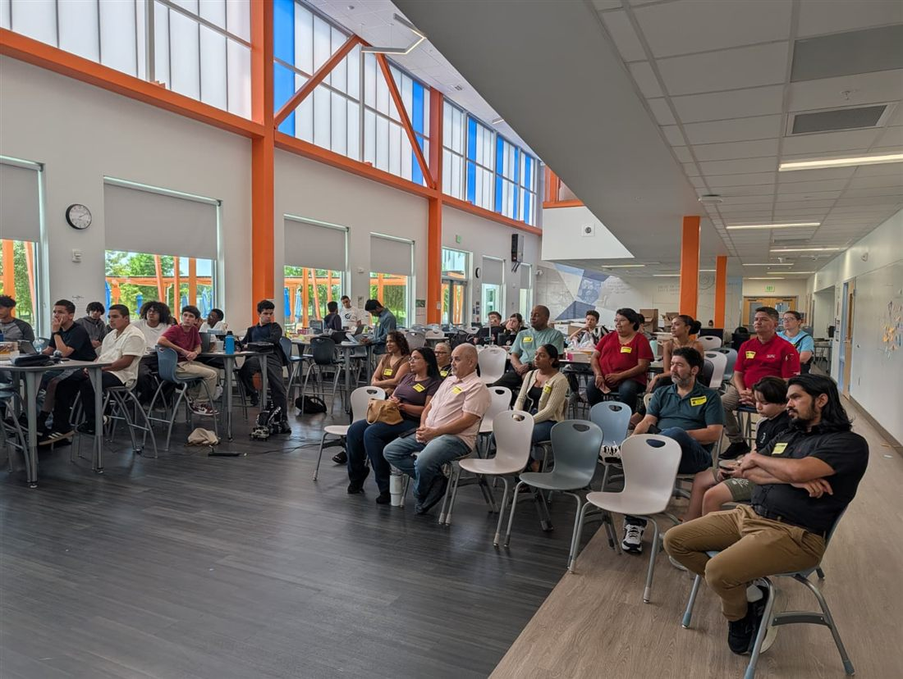
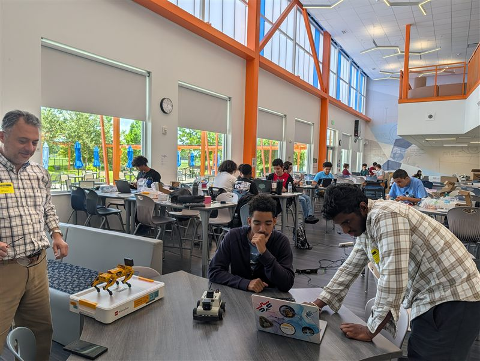

The NSF funded AI, Robotics, and Industry 5.0 Summer Camp extended the same five day summit model to
a new cohort of Central Florida high school students, held July 6 through 9, 2026 at NeoCity Academy.
The camp combined expert led instruction and hands on labs covering agentic AI, robotics, and human AI
collaboration with coding and prototyping exercises across block based tools, Python, and robot
operating systems. Students explored how AI enhances problem solving and creativity while critically
engaging with issues of ethics, privacy, and fairness, then worked in teams to design AI enabled
service solutions grounded in entrepreneurial thinking. As with the June institute, instruction
followed the project's four pillar AI competency framework, awareness, interaction, application, and
human AI co creation, across individual, team, and societal contexts.

Dr. Arthur Huang served as Principal Investigator, with Dr. Vishnunarayan Girishan Prabhu and
Dr. Mehmet Altin as Co-Principal Investigators.

