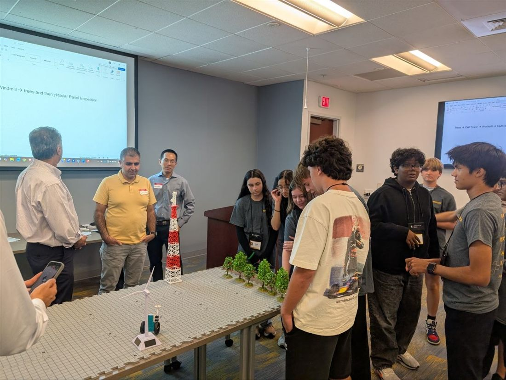
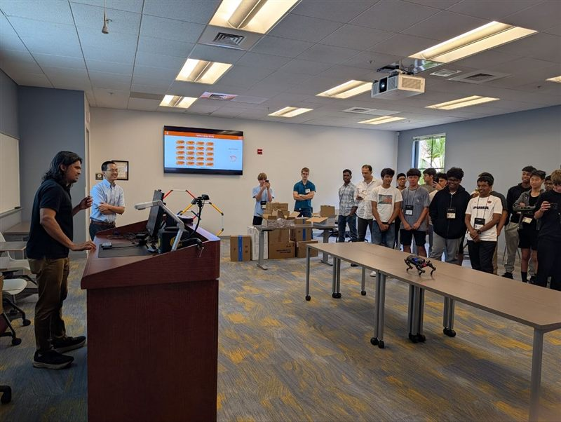

The NSF and VentureWell funded AI, Robotics, and Entrepreneurship Summer Institute brought Central
Florida high school students together for a five day summit on AI, robotics, and Industry 5.0
principles, held June 8 through 12, 2026 at the Rosen College of Hospitality Management. Sessions
covered core concepts in agentic AI, robotics, and human AI collaboration, alongside hands on coding
and prototyping using tools ranging from block based platforms to Python and robot operating systems.
Students also examined the ethical dimensions of AI adoption, including privacy, fairness, and human
centered design, before applying what they learned in team based entrepreneurial challenges, designing
mock business proposals and technical prototypes aimed at real world service sector problems. The
curriculum was structured around a four pillar AI competency framework, awareness, interaction,
application, and human AI co creation, spanning individual, team, and societal levels of learning.

Dr. Arthur Huang served as Principal Investigator, with Dr. Vishnunarayan Girishan Prabhu and
Dr. Mehmet Altin as Co-Principal Investigators.

