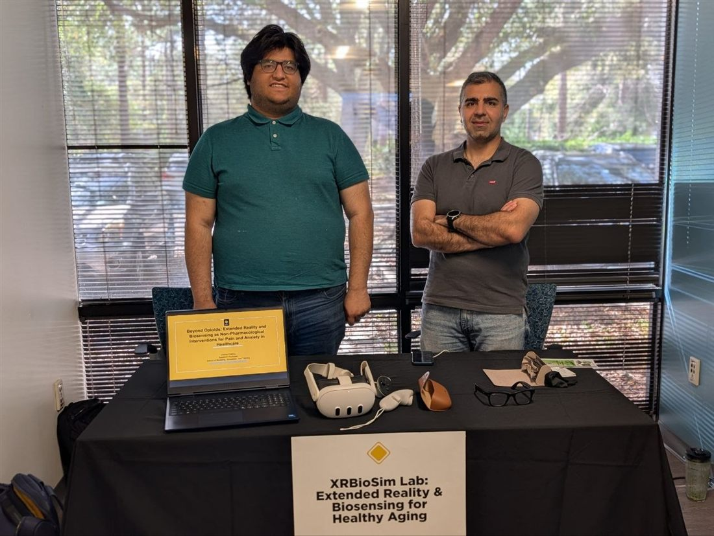

The XR BioSim Lab was invited to present at the [UCF Healthy Aging Fair](https://events.ucf.edu/event/4050868/ucf-healthy-aging-fair/),
held Friday, March 6, 2026 from 10 a.m. to 2 p.m. The lab showcased its work on extended reality (XR)
and multimodal biosensing for non-pharmacological reduction of pain and anxiety, presenting *Beyond
Opioids: Extended Reality and Biosensing as Non-Pharmacological Interventions for Pain and Anxiety in
Healthcare* to fair attendees. Ph.D. students Siddharth Abrol and Sayed Mohammad (Dariush) Sajjadi
staffed the table with hands-on XR and biosensing demos, while Dr. Prabhu demoed Meta's smart glasses
as an emerging, everyday platform for augmented reality and biosensing.

Dr. Prabhu's Meta glasses demo appears in the event's recap video at the 1:28–1:38 mark:
[watch the clip →](https://www.youtube.com/watch?v=TsPpI8UHa3E&t=88s)

